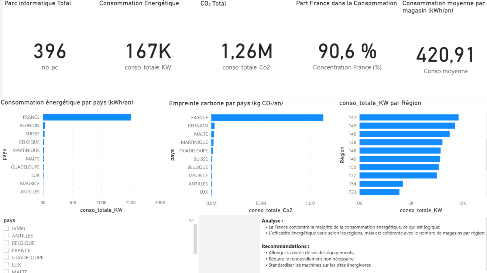
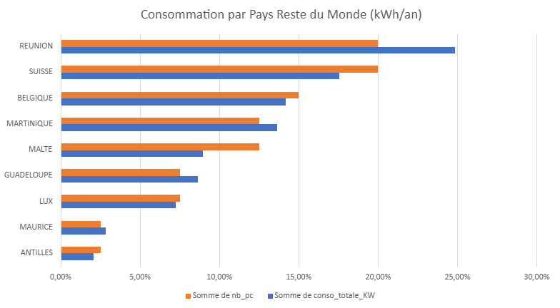
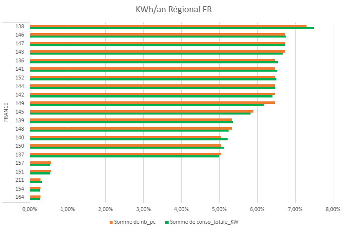
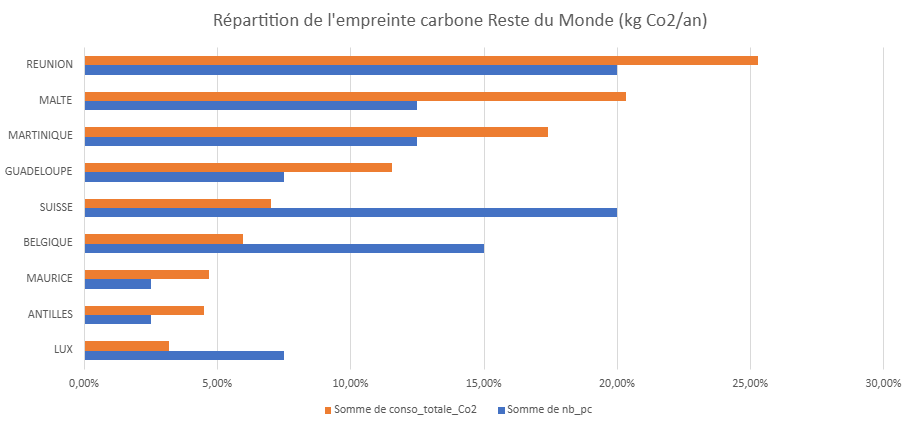
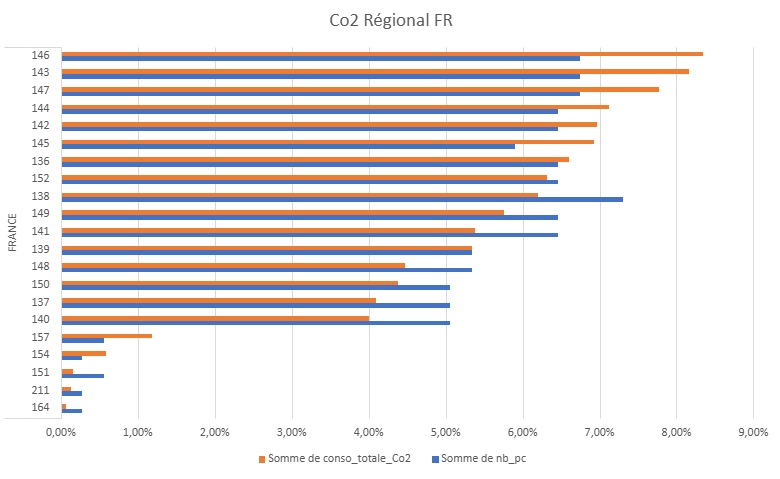

# 🌱 Analyse de l'impact environnemental d’un parc informatique multi-sites

---

## 📌 Contexte

Les entreprises cherchent à réduire l’impact environnemental de leurs infrastructures numériques.  
Ce projet vise à analyser la consommation énergétique et l’empreinte carbone d’un parc informatique afin d’identifier des axes d’optimisation.

---

## 🎯 Objectifs

- Mesurer la consommation énergétique du parc informatique (kWh)
- Évaluer l’empreinte carbone associée (CO₂)
- Identifier les sites les plus consommateurs
- Comparer l’efficacité énergétique entre les sites
- Proposer des recommandations d’optimisation

---

## 🧰 Outils utilisés

- Excel (préparation des données)
- Power BI (visualisation)
- DAX (mesures et KPI)
- Analyse de données

---

## 📊 KPI analysés

- Consommation totale (kWh)
- Empreinte carbone (kg CO₂)
- Nombre de postes informatiques
- Consommation moyenne par poste (kWh/PC)
- Répartition de la consommation par site

---

## 🔍 Principaux insights

- La consommation énergétique est fortement concentrée sur certains sites
- Des écarts importants d’efficacité énergétique existent entre les sites
- Le ratio kWh/PC permet d’identifier les zones les moins optimisées

---

## 💡 Recommandations

- Optimiser le renouvellement du matériel informatique
- Allonger la durée de vie des équipements
- Standardiser les configurations sur les sites les plus consommateurs
- Suivre régulièrement les indicateurs d’efficacité énergétique

---

## 📸 Aperçu du dashboard

---

## 🧠 Compétences démontrées

- Analyse et structuration de données
- Création de KPI
- Power BI (dashboards interactifs)
- DAX (mesures simples)
- Data storytelling
- Sensibilité Green IT

---

## 📸 Aperçu du dashboard

